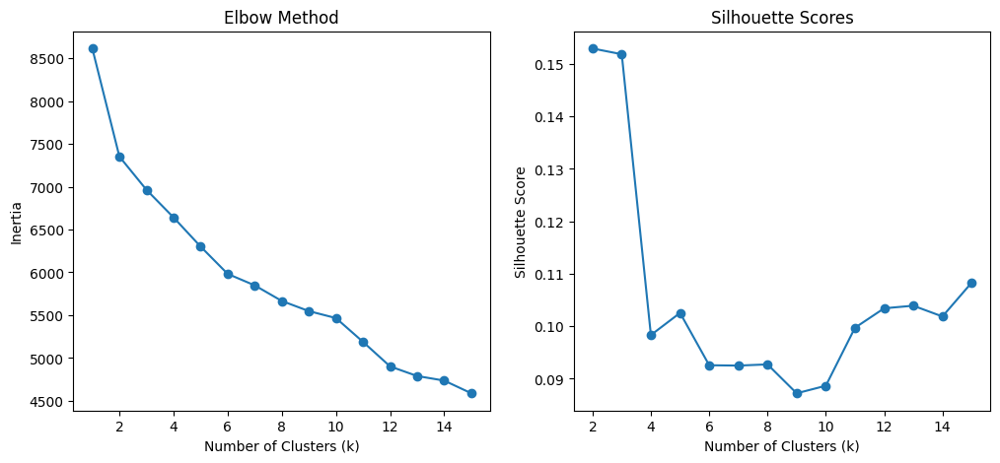
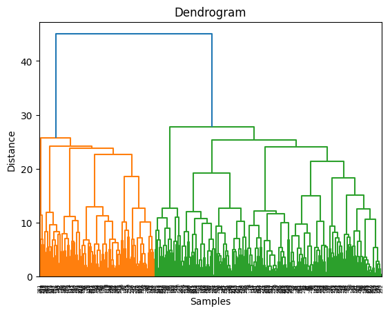
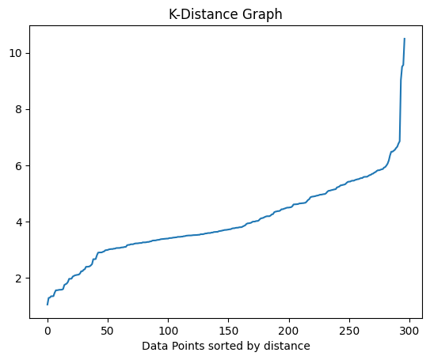
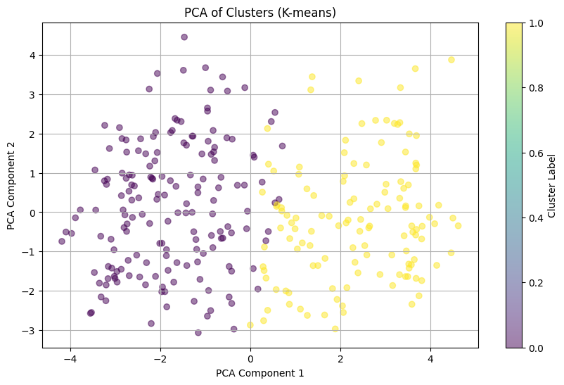
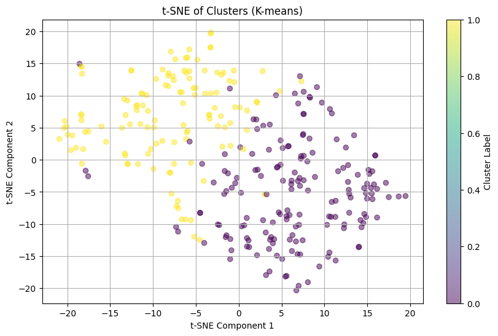

# Heart Disease Clustering Analysis

## Project Overview
This project aims to perform clustering analysis on heart disease data using various machine learning techniques. The goal is to identify patterns and groups within the dataset that might provide insights into heart disease risk factors and patient profiles.

## Dataset
The dataset used is the Cleveland Heart Disease dataset, which contains various attributes related to heart health. It includes both categorical and numerical features.

### Features
- age: Age of the patient
- sex: Sex of the patient (1 = male, 0 = female)
- cp: Chest pain type
- trestbps: Resting blood pressure
- chol: Serum cholesterol
- fbs: Fasting blood sugar > 120 mg/dl
- restecg: Resting electrocardiographic results
- thalach: Maximum heart rate achieved
- exang: Exercise induced angina
- oldpeak: ST depression induced by exercise relative to rest
- slope: The slope of the peak exercise ST segment
- ca: Number of major vessels colored by fluoroscopy
- thal: Thalassemia
- num: Diagnosis of heart disease (0 = absence, 1-4 = presence)

## Data Preprocessing
1. Handling missing values: '?' values were replaced with NaN.
2. Categorical encoding: One-hot encoding was applied to categorical variables.
3. Feature scaling: StandardScaler was used to scale all features.

## Exploratory Data Analysis (EDA)
- Unique value analysis for each categorical column
- Distribution plots for all scaled features

## Clustering Techniques
The project explores multiple clustering algorithms:

1. K-means Clustering
   - Elbow method and silhouette analysis for optimal k selection

   
2. Hierarchical Clustering
   - Dendrogram visualization

   
3. DBSCAN (Density-Based Spatial Clustering of Applications with Noise)
   - K-distance graph for eps parameter selection

   


## Dimensionality Reduction
To visualize high-dimensional clustering results:
1. Principal Component Analysis (PCA)

   

2. t-SNE (t-Distributed Stochastic Neighbor Embedding)

   


## Gaussian Mixture Model (GMM)
GMM was applied as an alternative probabilistic clustering approach.

## PCA AND tSNE Observation

1. `Clear Separation of Clusters`: Both the PCA and t-SNE plots show two distinct clusters, which could represent two groups of patients—likely those with heart disease and those without. The yellow and purple points might indicate these groups as determined by the K-means clustering.

2. `PCA (Principal Component Analysis) Plot:`

- The first two PCA components provide a linear transformation that captures the variance in the dataset. In the PCA plot, the clusters are separated but with some overlap in the middle. This suggests that while there are differences between the two groups, some features may be shared or less distinct between them.
- The spread along the PCA components shows how much variance is captured by each component, with the second PCA component (Y-axis) providing some additional separation.

3. `t-SNE (t-Distributed Stochastic Neighbor Embedding) Plot:`

- The t-SNE plot shows more pronounced separation between the clusters, which is typical because t-SNE is better at preserving local relationships in the high-dimensional space. The clustering appears clearer, with less overlap between the two groups.
- t-SNE is nonlinear and may better capture the underlying structure of the data, revealing more nuanced separations that PCA might not have shown. The tighter grouping within the clusters here suggests that K-means has identified distinct groups based on the features related to heart disease.

4. `Cluster Quality:`

Both plots suggest that the clustering algorithm (K-means) has successfully partitioned the data into two main groups, though PCA indicates some level of potential overlap in certain patients. t-SNE, on the other hand, shows a more distinct separation, indicating that the clusters might be well-defined in the high-dimensional space.

### Interpretation in the Context of Heart Disease:

The clear separation might reflect distinct patterns between patients with and without heart disease. The overlapping points in both plots may indicate patients with borderline or mixed features, suggesting either early-stage disease or non-conventional risk factors.


## Evaluation & Conclusion

The clustering methods—K-means, Hierarchical clustering, and Gaussian Mixture Models (GMM)—yielded the following performance metrics:

- K-means Silhouette Score: 0.153, Davies-Bouldin Index: 2.335
- Hierarchical Silhouette Score: 0.145, Davies-Bouldin Index: 2.570
- GMM Silhouette Score: 0.174, Davies-Bouldin Index: 2.953

These scores indicate that all three methods struggle to produce well-defined clusters, as evidenced by low Silhouette Scores and relatively high Davies-Bouldin Index values. Among the three, GMM performed slightly better in terms of cluster separation.

Despite the limited cluster distinctiveness, these algorithms provided valuable insights into the number of clusters, which guided effective dimensionality reduction using PCA and t-SNE. While PCA simplified the data's structure, t-SNE performed better at capturing local relationships and visualizing distinct clusters, making it a powerful tool for high-dimensional data interpretation and improving the overall data representation.

## Getting Started

### Prerequisites
- Python 3.7 or higher
- pip (Python package installer)

### Cloning the Repository
1. Open your terminal (Command Prompt on Windows, Terminal on macOS and Linux)
2. Run the following command to clone the repository:
   ```
   git clone https://github.com/kayc0des/clustering_formative.git
   ```
3. Navigate to the project directory:
   ```
   cd clustering_formative
   ```

### Setting up the Environment
1. It's recommended to create a virtual environment. Run:
   ```
   python -m venv venv
   ```
2. Activate the virtual environment:
   - On Windows:
     ```
     venv\Scripts\activate
     ```
   - On macOS and Linux:
     ```
     source venv/bin/activate
     ```
3. Install the required packages:
   ```
   pip install -r requirements.txt
   ```

### Running the Project
1. Start Jupyter Notebook:
   ```
   jupyter notebook
   ```
2. In the Jupyter interface, navigate to and open the `clustering_formative.ipynb` file.
3. Run the cells in the notebook sequentially to perform the analysis.

## Contributor
Kingsley Budu Boafo